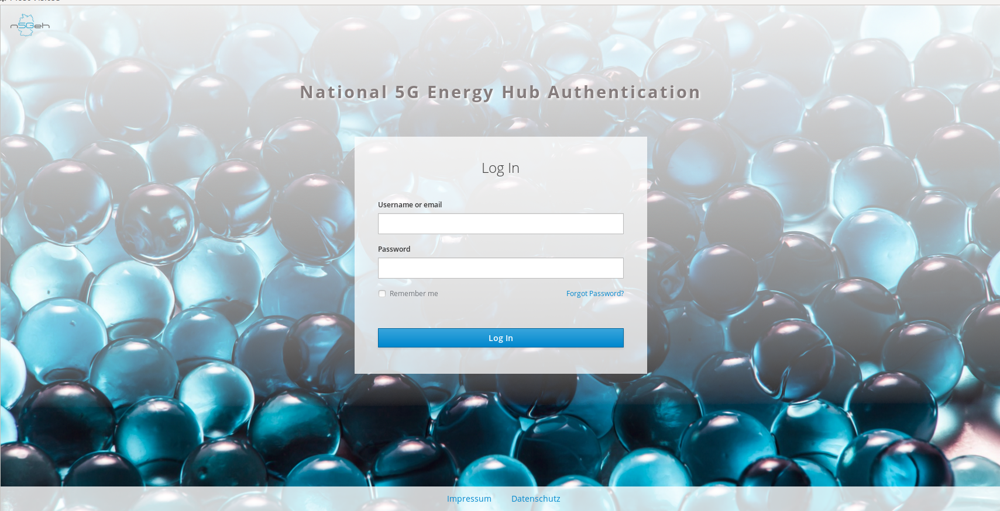
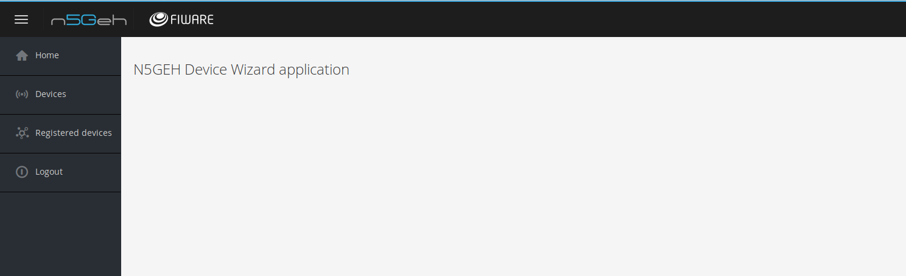
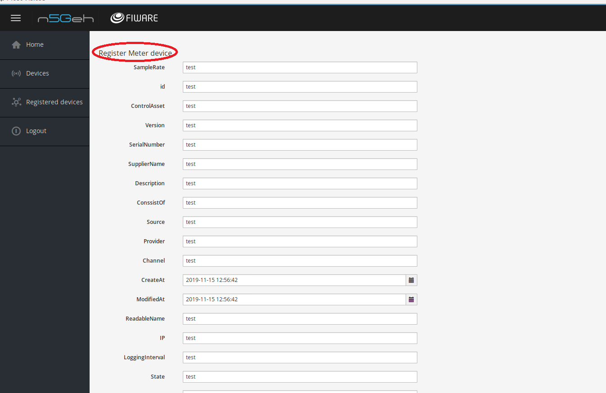
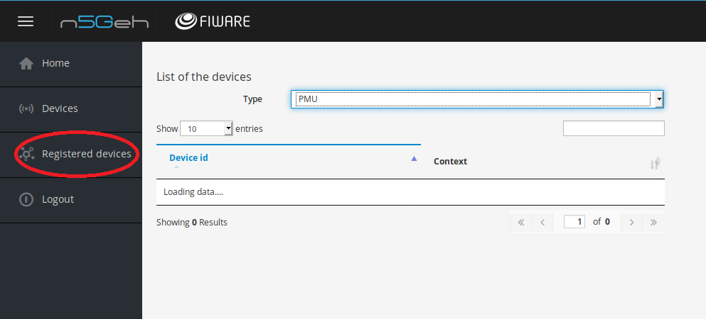

# device-manager-application

Repository for Device provisioning application so called DeviceWizard

## Content

-  [Installation of DeviceWizard ](#installation-of-devicewizard)
-   [GUI Application Overview](#gui-application-overview)


## Installation of DeviceWizard
This GUI prepared to provision and register IoT devices into the N5GEH project platform (https://n5geh.de/) .  This interface includes a data model and provides information for the user to register IoT devices. This interface hosts a list of the template that made for classes of the data model and provides an easy way to validate instances of classes into the platform.
  
   **Requirements**
   ```yaml
npm (verion >= 3.5.2)
python (version =3.6.8)
```

  **Installation**

Install all packages for the front end part 
```bash
$ cd static
$ npm install
```

Install all packages for the back end part 
```bash
$ cd device-wizard
$ pip install -r requirements.txt
```
  **Broker Configuration**

Here is an example of configuration file for the Device Wizard
```json
{
  "fiware_orion": "http://localhost:1026"
}
```
fiware_orion - end point for Orion LD server

Here is an example of docker-compose file for running Orion LD server instance:
```yaml
version: "3.5"
services:
  orion:
    image: fiware/orion-ld
    hostname: orion
    container_name: fiware-orion
    depends_on:
      - mongo-db
    expose:
      - "1026"
    ports:
      - "1026:1026"
    command: -dbhost mongo-db -logLevel DEBUG
    healthcheck:
      test: curl --fail -s http://orion:1026/version || exit 1
  mongo-db:
    image: mongo:3.6
    hostname: mongo-db
    container_name: db-mongo
    expose:
      - "27017"
    ports:
      - "27017:27017"
    command: --bind_ip_all --smallfiles
    volumes:
      - mongo-db:/data

volumes:
  mongo-db: ~
``` 
  **Run**
```bash
$ cd device-wizard
$ python main.py
```

## GUI Application Overview

This document describes the deviceWizard Graphical User Interface (GUI) Application.  The GUI is a Web Application which is first installed and then runs on the server. the application provides a convenient way to perform setup and demonstrate device registration features from within a standard Web application environment.
### Features
The GUI is a Web Split Pane Application. In general, features appear in the left pane and graphical content appears in the right pane. A separate, tabbed dialogue type interface supports board setup operations. The device demonstrates list of properties (with validation feed back) with dropdown menus, edit boxes and date table as the registration control. The registered devices Panel demonstrates a  selection control with the name of devices to filter and a table to present a list of already existing of this type of device in a table. 
The DeviceWizard GUI application itself was developed using Pycharm development environment and using the Python Native Language Support.
### Opening Screen

 Execute (Run) the GUI as written in the instruction. You will see the initial HOME Screen which contains username and password options for athenteícation. 
 


###  DeviceWizard Menus

This menu provides the usual {register , Open..., } options. In this application you use this menu and the associated Dialogs to register and modify IoT devices. Example; Assuming that you have registered the desired device type into application in the GUI, you can use the register menu to save the data to the platform. When you again run the GUI you can use the registered device to retrieve the already existing data to the GUI. 

  
 
####  Device Menu
This is the usual Web Edit Interface. 
You use this dialog to set properties of your device and open channel between the GUI Application and the platform. This will test communication and serve to registration  using the API (binary) Command Interface.  By selecting "Devices" in the left pane, the right pane list of device types will be shown. The user can select appreciated type of device from this dropdown menu and see list of properties belong to the device type by pressing register Button.

  
 
The Mandatory properties can not be left empety and you will recieve feedback about validation of provided information. A list of properties for PMU are presented in the image. 
 
   

####  Registered Devices Menu
This is the usual Web View Interface. This menu is currently used by the GUI application to reterive the existing devices. By selecting "Registered devices" in the left pane, in the right pane, user is able to filter according to the specific type of device from dropdown and decide how many row data wants to see. The result will be shown in the table of right pane.

   
